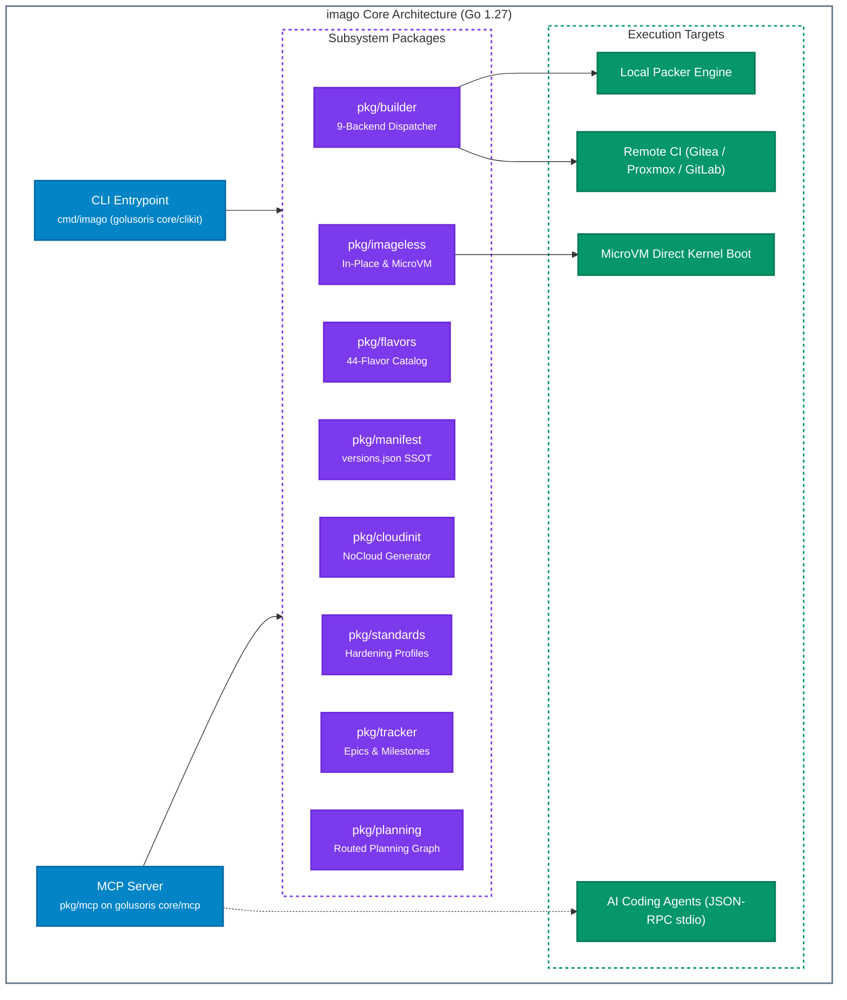
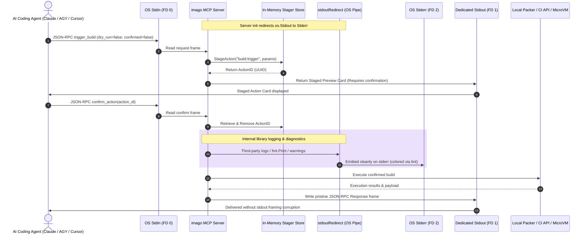
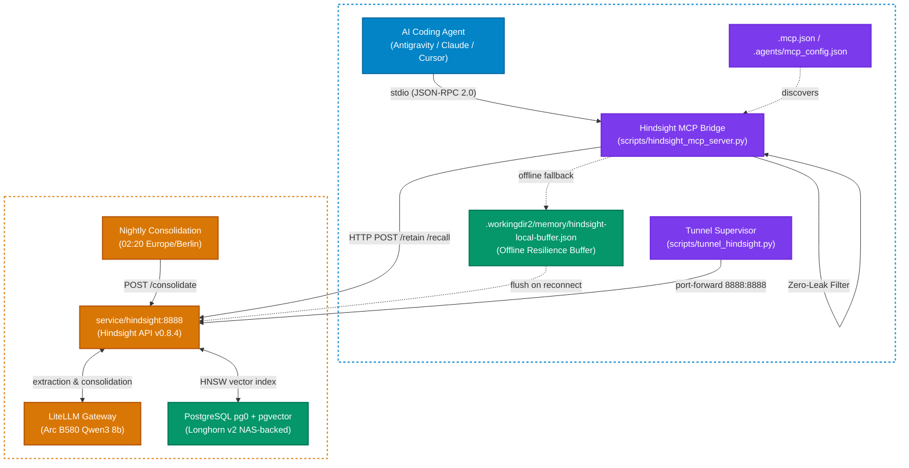

# Imago: Unified CLI & AI Model Context Protocol (MCP) Server

`imago` is the Go 1.27 engineering CLI and official Model Context Protocol (MCP) server of the image forge (`cordanaLLM/imago`, formerly `lusoris-cloud-images`). It unifies the 44-flavor catalog, cloud-init generator, multi-backend build dispatcher, imageless host provisioning, machine-verifiable hardening standards, recurring Epics/Milestones lifecycle tracking, and the routed planning graph. It is composed from [golusoris core](https://github.com/golusoris/golusoris): `core/clikit` builds the command tree, `core/log` provides the logger, `core/clock` supplies time, and `core/mcp` owns the MCP transport.

---

## 1. Architectural Principles

1. **Stdout Purity & Framing Protection**: In `stdio` MCP transport mode, golusoris `core/mcp` pins genuine `os.Stdout` exclusively for JSON-RPC message framing. All internal runtime messages and third-party library writes are redirected through an OS-level pipe to `os.Stderr`, preventing stream corruption. The guard lives in the framework; `imago` no longer carries its own copy.
2. **Single Source of Truth (`versions.json`)**: Version extraction and semantic assertions are performed directly against `versions.json` and `.github/epics.json`.
3. **Imageless Execution First**: Enables instant in-place host transformation or direct microVM kernel booting without requiring heavy disk imaging pipelines.
4. **Power of 10 & SEI CERT Compliance**: Every Go function is constrained to $\le 60$ statements with strict error wrapping (`%w`), zero goroutine leaks, and bounded timeouts.



---

## 2. Command-Line Interface (CLI) Reference

### 2.1 Flavor Catalog (`flavors`)
```bash
# List all 44 production flavors across all 7 tiers
imago flavors list

# Filter flavors by workload tier
imago flavors list --tier=kubernetes
imago flavors list --tier=homelab

# Output machine-readable JSON
imago flavors list --json

# Inspect exact specifications and provisioners for a flavor
imago flavors get appliance-vision-nvr
```

### 2.2 Version Manifest Verification (`manifest`)
```bash
# Validate versions.json semantic invariants
imago manifest validate
```

### 2.3 Hardened Cloud-Init Generation (`cloud-init`)
Generates production-hardened `user-data` YAML with Anycast NTS, secure non-root users, and hypervisor optimizations:
```bash
# Generate Proxmox cloud-init user-data
imago cloud-init generate --flavor=base-generic --hostname=node-01

# Generate Unraid virtiofs user-data
imago cloud-init generate --flavor=docker-generic --platform=unraid

# Generate TrueNAS SCALE NFS & VirtIO-SCSI discard user-data
imago cloud-init generate --flavor=docker-generic --platform=truenas

# Generate Apple Silicon macOS UTM user-data
imago cloud-init generate --flavor=base-generic --platform=macos
```

### 2.4 Multi-Backend Build Dispatcher (`build`)
Dispatches builds to local Packer or remote CI backends:
```bash
# Formulate local packer build command
imago build --flavor=base-generic --backend=local

# Simulate dispatch to self-hosted Gitea / Forgejo Actions
imago build --flavor=k8s-node-cilium --backend=gitea --dry-run

# Trigger Proxmox VE template clone
imago build --flavor=cloudnative-storage --backend=proxmox
```

Supported Backends: `local`, `gitea`, `proxmox`, `gitlab`, `woodpecker`, `harbor`, `minio`, `jenkins`, `github`.

### 2.5 Imageless Host Provisioning (`apply`)
Transforms a running Linux machine or container directly into any of the 44 flavors without flashing virtual disks:
```bash
# Dry-run inspection of provisioner steps
imago apply --flavor=ai-infer-nvidia --dry-run

# Execute in-place flavor application
imago apply --flavor=docker-generic | sudo bash
```

### 2.6 MicroVM Direct Kernel Boot (`boot`)
Generates direct kernel/initramfs boot commands for QEMU, Cloud-Hypervisor, or Firecracker:
```bash
imago boot --flavor=ai-infer-generic --kernel=/boot/vmlinuz --initrd=/boot/initrd.img
```

### 2.7 Machine-Verifiable Hardening Standards (`standards`)
```bash
# List hardening baselines across all 44 flavors
imago standards list

# Output exact sysctl, package, and systemd requirements for a flavor
imago standards get k8s-node-cilium
```

### 2.8 Epics and Milestones Tracking (`epics`, `milestones`)
```bash
# List tracked recurring operational epics
imago epics list

# List open release milestones and due dates
imago milestones list
```

### 2.9 Planning Graph Routing (`plan`)

```bash
# Validate planning/plan.json and planning/routing.json (schema, references, cycles, overlay coverage)
imago plan validate

# Rank every step: ready local work first, scored by (1 + transitive unblocks) / cost
imago plan route

# Ready set only, as JSON for agents and dashboards
imago plan route --ready --json
```

See [Planning Graph & Todo Routing](planning-graph.md) for the file layout and the routing policy.

### 2.10 Static Analysis & Repository Health (`lint`, `audit`)
```bash
# Run internal schema and catalog linters
imago lint

# Execute repository health audit script
imago audit
```

### 2.11 Aegis Product-Input Acceptance (`aegis`)

```bash
# Strictly decode and validate an Aegis product-input manifest (aegis.p01.product-input.v1)
imago aegis validate build/product-input.json

# Print the mapped imago build request as JSON
imago aegis validate build/product-input.json --json
```

The decoder rejects unknown fields, trailing content, and manifests above 1 MiB. Every rejection is a correlated error `aegis product-input <correlation-id>: <field>: <reason>` (`(missing)` when the manifest carries no correlation id) and exits non-zero. Contract bounds: `retries.max-attempts` 1..10, `retries.backoff-seconds` 0..3600, 1..256 unique packages, `revision` exactly 40 lowercase hex characters, definition paths relative and free of `..` segments. See [ADR-0020](../adr/0020-aegis-product-input-contract-acceptance.md) for the full contract and why the request is not a Packer flavor dispatch.

---

## 3. Model Context Protocol (MCP) Server Integration

`imago` exposes native AI tooling conforming to the Model Context Protocol v1.7.0.

### 3.1 Launching the Server
```bash
# Stdio transport (default for AI agents, Claude Desktop, Cursor)
imago mcp --transport=stdio

# Streamable-HTTP transport (remote clients), served at /mcp
imago mcp --transport=http --addr=:8899
```

### 3.2 Client Configuration Example (`claude_desktop_config.json`)
```json
{
  "mcpServers": {
    "imago": {
      "command": "/usr/local/bin/imago",
      "args": ["mcp", "--transport=stdio"]
    }
  }
}
```

### 3.3 Registered MCP Tools

| Tool Identifier | Parameters | Description |
| :--- | :--- | :--- |
| **`list_flavors`** | `tier` (optional string) | List available flavors filtered by workload tier |
| **`get_flavor`** | `flavor_id` (string) | Return hardware stack, kernel profile, and provisioners |
| **`validate_manifest`**| `path` (optional string) | Validate `versions.json` Single Source of Truth |
| **`generate_cloudinit`**| `flavor`, `hostname`, `platform` | Generate hardened cloud-init YAML user-data |
| **`get_standards`** | `flavor_id` (string) | Query machine-readable CIS/BSI hardening requirements |
| **`list_epics`** | None | List recurring operational and architectural epics |
| **`get_milestones`** | None | List active release milestones |
| **`trigger_build`** | `flavor`, `backend`, `dry_run`, `confirmed` | Dispatch build to local or remote CI backends (supports staging) |
| **`apply_flavor`** | `flavor_id`, `dry_run` | Generate in-place host provisioning bash script |
| **`inspect_compliance`** | None | Inspect declarative CIS/NIST compliance profile |
| **`list_staged_actions`** | None | List pending staged actions requiring operator confirmation |
| **`confirm_action`** | `action_id` (string) | Confirm and execute a pending staged mutation |
| **`discard_staged_action`** | `action_id` (string) | Discard and abort a pending staged mutation |
| **`route_plan`** | `plan_path`, `routing_path` (optional, repository-relative), `ready_only` (bool) | Validate the planning graph and return steps ranked by (1 + transitive unblocks) / cost |

---

### 3.4 Two-Phase Staged Operations & Human-in-the-Loop Guardrails

To prevent accidental execution of heavy or destructive tasks (e.g. running Packer image builds or triggering external CI jobs) by autonomous agents, `imago` implements a **Two-Phase Mutation Guardrail** pattern inspired by OmniKube:

1. **Staged Invocation**: When an agent calls `trigger_build` with `dry_run=false` and without `confirmed=true`, the MCP server does not immediately run the command. Instead, it registers a `StagedAction` in an in-memory thread-safe `Stager` store, generates a cryptographically random UUID (`action_id`), and returns a rich preview card:
   - Action ID and mutation description
   - Command line or API payload to be dispatched
   - Risk assessment level (`low`, `medium`, `high`)
   - Target backend and flavor parameters
2. **Review & Introspection**: The agent or human operator can review the exact command and inspect all pending operations via `list_staged_actions`.
3. **Explicit Confirmation or Discard**:
   - To proceed: invoke `confirm_action(action_id="...")` (or pass `confirmed=true` directly in the initial call if explicitly pre-authorized).
   - To cancel: invoke `discard_staged_action(action_id="...")`. Staged actions also automatically expire after 15 minutes.

---

### 3.5 MCP Stdio Protocol & Framing Protection Sequence



---

## 4. Hindsight Semantic Memory & Cluster Knowledge Integration

Beyond the repository image forge tools, `lusoris-cloud-images` natively integrates with the self-hosted **Hindsight** (`v0.8.4`) semantic memory engine deployed in the companion `lusoris/k8s` cluster ([ADR-0013](../adr/0013-hindsight-semantic-memory-mcp.md)).



### 4.1 Client Configuration (`.mcp.json` & `.agents/mcp_config.json`)

Both manifests declare the stdio Hindsight bridge and optional cluster knowledge tools:

```json
{
  "mcpServers": {
    "hindsight": {
      "command": "python",
      "args": ["scripts/hindsight_mcp_server.py"],
      "env": {
        "HINDSIGHT_URL": "http://127.0.0.1:8888",
        "HINDSIGHT_BANK": "lusoris-cloud-images"
      }
    },
    "cauda-kb": {
      "serverUrl": "http://127.0.0.1:38001/mcp"
    },
    "context7": {
      "command": "npx",
      "args": ["-y", "@upstash/context7-mcp@3.1.0"]
    }
  }
}
```

### 4.2 Registered Memory Tools

| Tool Identifier | Parameters | Description |
| :--- | :--- | :--- |
| **`hindsight_recall`** | `query` (string), `top_k` (int, default 5), `bank_id` (string) | Semantic hybrid retrieval over durable architectural rules, bug root causes, and previous decisions |
| **`hindsight_retain`** | `content` (string), `context` (string), `bank_id` (string) | Persists discoveries, rationale, and constraints into Hindsight memory |
| **`hindsight_reflect`**| `bank_id` (string) | Triggers observation consolidation and mental model synthesis |
| **`hindsight_status`** | None | Probes backend connectivity, active bank count, and local buffer state |
| **`hindsight_list_banks`** | None | Lists available fleet memory banks in the tenant |

### 4.3 Zero-Leak Privacy Guard
Prior to retaining any facts into Hindsight vector memory, `scripts/hindsight_mcp_server.py` automatically strips:
- RFC 1918 private IP addresses (`10.x`, `192.168.x`, `172.16-31.x` -> `[REDACTED-RFC1918-IP]`).
- Workstation user directories (`/home/<user>`, `/Users/<user>`, `C:\Users\<user>` -> `[REDACTED-USER-PATH]`).

### 4.4 Cluster Port-Forwarding Supervisor
To bridge the cluster-private service to `127.0.0.1:8888`:

```bash
# Check connectivity
python scripts/tunnel_hindsight.py --check

# Start tunnel supervisor daemon
python scripts/tunnel_hindsight.py
```

