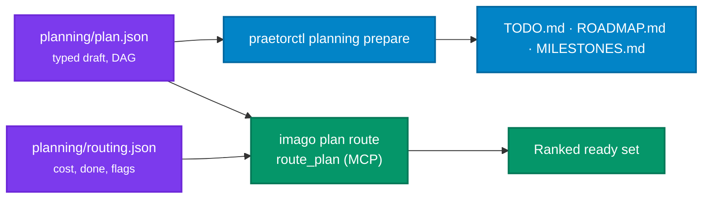

# Planning Graph & Todo Routing

The migration to `cordanaLLM/imago` is tracked as a typed dependency graph under [`planning/`](https://github.com/cordanaLLM/imago/tree/main/planning), compiled with praetor's planning compiler and routed by the `imago` CLI. Recurring, cadence-driven work stays in `.github/epics.json`; one-off work with dependencies lives in the graph.

## Files

| File | Authority | Contents |
| :--- | :--- | :--- |
| `planning/plan.json` | Canonical draft (praetor planning schema version 1) | Sources with SHA-256, cited requirements, milestones, steps with `depends_on`, actions, expected outputs, and positive/negative/boundary acceptance proposals. |
| `planning/TODO.md`, `ROADMAP.md`, `MILESTONES.md` | Generated projections | Rendered by `praetorctl planning prepare`; cross-linked by stable IDs and the plan digest. Never edited by hand. |
| `planning/routing.json` | Routing overlay | Per-step cost class, completion, owner, and the flags that push work behind local steps (`needs_external_contract`, `needs_hardware`). |
| `planning/DECISIONS.md` | Planning source | Operator decisions the plan cites by hash; changing a decision invalidates the dependent draft. |
| `planning/archetypes/os-image.yaml` | Upstream proposal | The praetor archetype this repository declares once praetor ships it. |



## Routing policy

`imago plan route` validates both files, derives each step's state, and ranks the graph:

1. **State**: `done` when the overlay marks it complete; `ready` when every direct dependency is done; otherwise `blocked`.
2. **Order**: ready steps first, then blocked, then done.
3. **Local before external**: among ready steps, work that needs no external contract and no hardware ranks ahead of flagged work, whatever its score.
4. **Score**: `(1 + transitive unblocks) / cost`, with cost weights `trivial=1`, `small=2`, `medium=4`, `large=8` (the Aegis-OS scale).
5. **Ties**: more transitive unblocks first, then the lexicographically smaller step ID, so the output is deterministic.

```bash
imago plan validate                 # schema, references, cycle check, overlay coverage
imago plan route                    # full ranked table
imago plan route --ready --json     # ready set for agents and dashboards
```

The `route_plan` MCP tool returns the same JSON. Paths are repository-relative; absolute paths and `..` are rejected.

## Recompiling the projections

`plan.json` is the input and the canonical output of praetor's compiler. After editing it, recompile into a new directory and copy the four artifacts back; the digest in every projection must match.

```bash
praetorctl planning prepare --input planning/plan.json --output-dir .workingdir/planning-next
cp .workingdir/planning-next/{plan.json,TODO.md,ROADMAP.md,MILESTONES.md} planning/
imago plan validate
```

The compiler rejects incomplete steps, unknown references, uncovered requirements, and dependency cycles. It does not verify source bytes, execute actions, or record completion; completion lives in `routing.json` and is proven by the evidence each step names.
